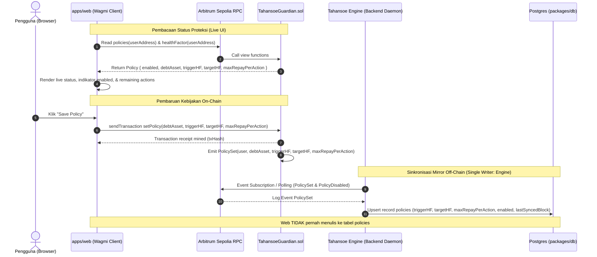

# Spec: M1 — Integrasi Web dengan Guardian On-Chain (Arbitrum Sepolia)

- **Milestone:** M1 — Dashboard monitoring live & integrasi Guardian on-chain (lihat [PRD §10](../prd.md#10-roadmap-eksekusi))
- **Status:** Draft
- **Pemilik:** Antigravity (Agent)
- **Terkait:** [PRD §7.1, §10](../prd.md), [Architecture §3.1, §4, §5](../architecture.md), [Security §2.4, §4](../security.md), [ADR 0003](../decisions/0003-eoa-erc20-approval-bukan-safe-module.md), [ADR 0006](../decisions/0006-model-bisnis-freemium.md), [ADR 0007](../decisions/0007-monorepo-structure-and-runtime.md), [Spec M2: Engine Skeleton](m2-engine-skeleton.md)

---

## 1. Tujuan

Menghubungkan antarmuka web Tahansoe (`apps/web`) secara langsung ke kontrak `TahansoeGuardian` dan pool lending Aave V3 di Arbitrum Sepolia, sehingga pengguna EOA dapat memantau Health Factor posisi pinjaman riil mereka, mengonfigurasi batas proteksi likuidasi (`triggerHF`, `targetHF`, `maxRepayPerAction`), memantau sisa kuota proteksi dari allowance dan saldo dompet, memberikan delegasi allowance ERC20 terbatas (bukan unlimited) secara aman, serta membatalkan atau mencabut otorisasi kapan saja tanpa perantara terpusat.

---

## 2. Scope

### Termasuk:
1. **Halaman Pengaturan Proteksi (`apps/web/app/dashboard/settings`):**
   - Form konfigurasi parameter kebijakan proteksi: `debtAsset`, `triggerHF`, `targetHF`, dan `maxRepayPerAction`.
   - Transaksi interaktif via wagmi di Arbitrum Sepolia:
     - `ERC20.approve(guardian, boundedAllowance)` dengan allowance terbatas (rekomendasi 1–3x `maxRepayPerAction`, menolak unlimited allowance secara default).
     - `TahansoeGuardian.setPolicy(debtAsset, triggerHF, targetHF, maxRepayPerAction)`.
   - Aksi penghentian darurat: pemanggilan `TahansoeGuardian.disablePolicy()` dan pencabutan persetujuan `ERC20.approve(guardian, 0)` (penegakan Invariant I7).
2. **Pemantauan Kapasitas Proteksi (Hot Reserve & Allowance):**
   - Tampilan visual sisa allowance ERC20 dan saldo token hutang (`balanceOf`) pengguna di dompet.
   - Indikator estimasi sisa tindakan proteksi: $\lfloor \text{allowance} / \text{maxRepayPerAction} \rfloor$.
   - Peringatan visual tegas jika sisa kapasitas $< 1$ tindakan untuk mencegah proteksi berhenti diam-diam saat allowance atau saldo menipis.
3. **Penyelarasan Sumber Kebenaran (Single Source of Truth):**
   - Pembacaan data status live on-chain melalui wagmi hooks: `policies(user)`, `healthFactor(user)`, dan `needsProtection(user)`.
   - Kontrak on-chain bertindak sebagai Single Source of Truth (SSOT). Web app **hanya membaca** data policy dari kontrak untuk kebutuhan tampilan UI dan **tidak menulis** ke tabel `policies` database.
   - Penulis tunggal (*single writer*) mirror tabel `policies` database adalah komponen event sync di backend engine (M2) yang mendengarkan event on-chain `PolicySet` dan `PolicyDisabled`.
4. **Penyajian Posisi Riil Aave V3 & Isolasi Mode Demo:**
   - Pembacaan data posisi peminjam asli dari kontrak Aave V3 Pool Arbitrum Sepolia (`getUserAccountData`).
   - Pemisahan simulasi frontend in-memory lama ke dalam modul terisolasi `apps/web/features/demo/` (sesuai ADR 0007 Fase 3) dengan toggle UI eksplisit di header dashboard ("Live Testnet" vs "Demo Simulator").
5. **Refaktor Identitas Pengguna & Migrasi Skema DB:**
   - Menghapus kolom `chainId` dari constraint unik tabel `users` pada `packages/db/src/schema.ts`, mengubahnya menjadi unik per `walletAddress` (sesuai Architecture §5: 1 pengguna EOA global).
   - Menyiapkan berkas migrasi Drizzle untuk menyelaraskan skema `users` dan `policies` (kolom `enabled`, `triggerHF`, `targetHF`, `maxRepayPerAction`).
6. **Pemisahan Boundary Notifikasi Telegram (Resolusi S4):**
   - Menghapus logika pemicu alert browser berbasis `useEffect` di frontend.
   - Membatasi tanggung jawab web app hanya pada otentikasi SIWE, penghubungan akun Telegram (`/api/telegram/*`), dan penyimpanan preferensi pengguna.
   - Pengiriman alert monitoring 24/7 (termasuk alert `RESERVE_LOW` ketika allowance/saldo menipis) dialihkan sepenuhnya ke engine backend.
7. **Pembersihan Copywriting UI (Anti-Stale Copy):**
   - Mengganti seluruh referensi usang yang masih menyebut "Safe Module" atau "Flash Loan Deleverage" untuk v1 menjadi otorisasi non-custodial EOA ERC20 ke `TahansoeGuardian` (sesuai ADR 0003).

### Tidak termasuk:
1. Eksekusi bot keeper otonom (`protect(user)`) dan evaluasi rebalancing on-chain (dikerjakan pada Milestone M3).
2. Risk assessment loop AI, ingestion sinyal pasar makro, dan LLM research agents (dikerjakan pada Milestone M2).
3. Sinkronisasi event on-chain ke tabel `policies` database (ditangani oleh engine daemon pada Milestone M2).
4. Penerapan di mainnet (Arbitrum One) atau protokol selain Aave V3 (Morpho Blue dijadwalkan pada M5).
5. Strategi eksekusi deleverage berbasis flash loan pada kontrak on-chain (direncanakan pasca-v1 sesuai roadmap PRD).

---

## 3. Desain

### 3.1 Arsitektur Halaman Settings (`apps/web/app/dashboard/settings/page.tsx`)

Halaman Settings bertransformasi dari sekadar form in-memory mock menjadi dashboard kontrol interaksi Web3 yang terhubung ke jaringan Arbitrum Sepolia (Chain ID `421614`).

```
+-----------------------------------------------------------------------------------+
|                            DASHBOARD SETTINGS (M1)                                |
+-----------------------------------------------------------------------------------+
|  [Wallet Status]                                                                  |
|  Address: 0x1234...abcd | Network: Arbitrum Sepolia (421614)                     |
+-----------------------------------------------------------------------------------+
|  [On-Chain Policy Status: ENABLED / DISABLED]                                     |
|  Current Trigger: 1.25 HF | Current Target: 1.50 HF | Max Repay: 500 USDC         |
|  Wallet Balance: 1,500 USDC | Guardian Allowance: 1,000 USDC                      |
|  Remaining Capacity: 2 actions (based on allowance & balance)                     |
|  Needs Protection: NO                                                             |
+-----------------------------------------------------------------------------------+
|  [Peringatan Kapasitas Proteksi (Jika Sisa Tindakan < 1)]                         |
|  (!) Warning: Allowance atau saldo di dompet Anda tersisa kurang dari 1 aksi      |
|      proteksi. Segera tambah allowance atau top up saldo USDC Anda.               |
+-----------------------------------------------------------------------------------+
|  [Form Konfigurasi Proteksi]                                                      |
|  - Debt Asset:          [ USDC (0x75faf...46AA4d) v ]                             |
|  - Trigger HF:          [ 1.25 ]  (Batas bawah pemicu proteksi, min 1.05)         |
|  - Target HF:           [ 1.50 ]  (HF pemulihan setelah intervensi, > Trigger)    |
|  - Max Repay per Tx:    [ 500  ]  USDC (Batas maksimal modal per eksekusi)        |
|  - Delegasi Allowance:  (o) 1x (500)   ( ) 2x (1,000)   ( ) Custom [ 1,500 ]      |
|                                                                                   |
|  [ Action Buttons ]                                                               |
|  [ Step 1: Approve USDC ] ---> [ Step 2: Save On-Chain Policy (setPolicy) ]       |
+-----------------------------------------------------------------------------------+
|  [Zona Bahaya & Penghentian Darurat (Invariant I7)]                               |
|  [ Deactivate Policy (disablePolicy) ]      [ Revoke Allowance (approve 0) ]       |
+-----------------------------------------------------------------------------------+
```

#### 3.1.1 Struktur Struct dan Validasi Sesuai Kontrak
Mengikuti deklarasi kanonik pada `contracts/src/TahansoeGuardian.sol`:
```solidity
struct Policy {
    bool enabled;
    address debtAsset;
    uint128 triggerHF; // WAD (18 decimals)
    uint128 targetHF;  // WAD (18 decimals)
    uint256 maxRepayPerAction; // in debtAsset units
}
```

Aturan validasi input pada antarmuka pengguna mengacu persis pada logika revert `InvalidPolicy()` di kontrak:
- `debtAsset !== "0x0000000000000000000000000000000000000000"`
- `triggerHF >= MIN_TRIGGER_HF` ($1.05 \times 10^{18}$)
- `targetHF > triggerHF`
- `targetHF <= MAX_TARGET_HF` ($3.00 \times 10^{18}$)
- `maxRepayPerAction > 0`

#### 3.1.2 Komponen Alur Transaksi Wagmi:
1. **Pre-check Kondisi Form & Jaringan:**
   - Memastikan `chainId === 421614`. Jika tidak cocok, antarmuka memblokir form dan menampilkan tombol `Switch Network to Arbitrum Sepolia`.
   - Melakukan validasi batas input di atas sebelum mengizinkan penandatanganan transaksi.
2. **Step 1 — Delegasi Allowance Terbatas (`ERC20.approve`):**
   - Web app membaca allowance aktif pengguna ke alamat Guardian:
     ```ts
     const { data: currentAllowance } = useReadContract({
       address: debtAssetAddress,
       abi: erc20Abi,
       functionName: 'allowance',
       args: [userAddress, guardianAddress],
     });
     ```
   - Jika `currentAllowance < requiredAllowance`, tombol "Step 1: Approve [Asset]" aktif.
   - Rekomendasi allowance:
     - **1x tindakan:** Sebesar `maxRepayPerAction` (paling aman).
     - **3x tindakan:** `3 * maxRepayPerAction` (menghindari approve berulang saat keeper mengeksekusi).
     - **Kustom:** Nilai nominal spesifik yang ditentukan pengguna.
     - *Catatan Keamanan:* Nilai `type(uint256).max` tidak disediakan sebagai opsi default demi meminimalkan risiko kerugian jika terjadi kegagalan sistem.
3. **Step 2 — Pendaftaran Kebijakan On-Chain (`Guardian.setPolicy`):**
   - Setelah transaksi approval selesai (`receipt.status === 'success'`), tombol "Step 2: Save On-Chain Policy" aktif.
   - Mengirim transaksi ke `TahansoeGuardian`:
     ```ts
     writeContract({
       address: guardianAddress,
       abi: TahansoeGuardianAbi,
       functionName: 'setPolicy',
       args: [
         debtAssetAddress,
         parseUnits(triggerHF.toString(), 18),
         parseUnits(targetHF.toString(), 18),
         parseUnits(maxRepayPerAction.toString(), tokenDecimals)
       ]
     });
     ```
   - Transaksi ini memancarkan event:
     `PolicySet(address indexed user, address indexed debtAsset, uint256 triggerHF, uint256 targetHF, uint256 maxRepayPerAction)`.
4. **Emergency Stop (Invariant I7):**
   - **Tombol "Deactivate Policy":** Memanggil `TahansoeGuardian.disablePolicy()`. Menyetel `policy.enabled = false` on-chain dan memancarkan event `PolicyDisabled(address indexed user)`.
   - **Tombol "Revoke Allowance":** Memanggil `ERC20.approve(guardianAddress, 0n)`. Menghapus hak penarikan token secara absolut.

---

### 3.2 Pemantauan Kapasitas Proteksi (Allowance & Saldo Hot Reserve)

Kontrak `TahansoeGuardian.sol` pada fungsi `quoteRepay` menentukan plafon pelunasan melalui kalkulasi:
```solidity
amount = _min(amount, p.maxRepayPerAction);
amount = _min(amount, IERC20(p.debtAsset).balanceOf(user));
amount = _min(amount, IERC20(p.debtAsset).allowance(user, address(this)));
```
Karena allowance dan saldo dompet dibatasi, eksekusi proteksi oleh keeper akan mengikis sisa allowance dan saldo. Tanpa visibilitas di UI, proteksi dapat terhenti diam-diam (*silent stop*) saat allowance atau saldo habis, meskipun `policy.enabled === true`.

#### Fitur Visibilitas di UI:
1. **Pembacaan Status Kuota:**
   - Membaca `IERC20.allowance(user, guardian)`.
   - Membaca `IERC20.balanceOf(user)`.
   - Membaca `p.maxRepayPerAction` dari `policies(user)`.
2. **Kalkulasi Sisa Aksi Proteksi:**
   $$\text{actionsByAllowance} = \lfloor \text{allowance} / \text{maxRepayPerAction} \rfloor$$
   $$\text{actionsByBalance} = \lfloor \text{balanceOf} / \text{maxRepayPerAction} \rfloor$$
   $$\text{remainingActions} = \min(\text{actionsByAllowance}, \text{actionsByBalance})$$
3. **Peringatan Rendah (Low Reserve Warning):**
   - Jika $\text{remainingActions} < 1$: Menampilkan banner peringatan berlatar oranye/merah di halaman dashboard dan settings:
     *"Kapasitas proteksi tidak memadai (< 1 aksi pelunasan). Keeper tidak dapat melindungi posisi Anda secara optimal jika HF turun. Silakan tambah allowance atau top up saldo."*
4. **Boundary Notifikasi Telegram:**
   - Web app hanya bertugas menampilkan kondisi ini pada UI saat pengguna membuka dashboard.
   - Peringatan dini otomatis 24/7 ke Telegram pengguna (`RESERVE_LOW`) ditangani oleh backend engine yang secara berkala memeriksa sisa kuota tanpa bergantung pada status browser aktif.

---

### 3.3 Single Source of Truth (SSOT) & Pemisahan Penulisan Database

Kontrak on-chain adalah satu-satunya **Single Source of Truth** untuk konfigurasi dan status eksekusi kebijakan proteksi. Web app sama sekali tidak menulis ke tabel `policies` di database PostgreSQL.



- **Pemisahan Peran:**
  - `apps/web`: Pure consumer / viewer. Membaca data status secara langsung dari RPC kontrak melalui wagmi hooks.
  - `engine`: Single writer untuk tabel `policies`. Mendengarkan event `PolicySet` dan `PolicyDisabled` lalu memperbarui record database PostgreSQL untuk kepentingan query off-chain keeper dan bot notifikasi.

---

### 3.4 Integrasi Posisi Riil Aave V3 vs Demo Mode

#### 3.4.1 Pembacaan Posisi Live Aave V3
Web app membaca posisi pinjaman pengguna langsung dari `PoolAddressesProvider` dan `Pool` Aave V3 di Arbitrum Sepolia:
- **Alamat Kontrak:**
  - `Aave PoolAddressesProvider`: `0xa97684ead0e402dC232d5A977953DF7ECBaB3CDb`
  - `Aave Pool Proxy`: `0xBfC91D59fdAA134A4ED45f7B584cAf96D7792Eff` (diperoleh secara dinamis via `@tahansoe/domain`).
- **Fungsi On-Chain:** `IPool.getUserAccountData(userAddress)`
  Mengembalikan tuple:
  - `totalCollateralBase` (USD, 8 decimals)
  - `totalDebtBase` (USD, 8 decimals)
  - `availableBorrowsBase` (USD, 8 decimals)
  - `currentLiquidationThreshold` (basis points, 4 decimals)
  - `ltv` (basis points, 4 decimals)
  - `healthFactor` (wad, 18 decimals)

#### 3.4.2 Pemisahan Modul Demo (`apps/web/features/demo/`)
Sesuai ketetapan ADR 0007 Fase 3, simulasi harga lokal yang sebelumnya bercampur di `apps/web/lib/simulation-engine.tsx` dipindahkan ke arsitektur modular:
- Berkas yang dipindahkan:
  - `apps/web/lib/simulation-engine.tsx` $\to$ `apps/web/features/demo/simulation-engine.tsx`
  - `apps/web/lib/simulation-context.tsx` $\to$ `apps/web/features/demo/simulation-context.tsx`
  - `apps/web/lib/mock-data.ts` $\to$ `apps/web/features/demo/mock-data.ts`
- **Toggle Mode UI:**
  Di bilah navigasi atas (dashboard layout), dipasang sakelar mode:
  ```
  [ * Live (Arbitrum Sepolia) ]  <--->  [ ? Demo Simulator ]
  ```
  - Mode **Live:** Menampilkan widget wagmi, saldo dompet, posisi Aave nyata, dan status kontrak Guardian nyata.
  - Mode **Demo:** Menampilkan visual banner kuning mencolok: *"MODE SIMULASI — Data pasar dan eksekusi bersifat simulasi in-memory untuk tujuan demo"*. Seluruh state dikelola oleh `SimulationProvider`.

---

### 3.5 Skema Database & Rencana Migrasi Drizzle

Sesuai dokumen arsitektur (`docs/architecture.md` §5), satu pengguna diidentifikasi secara unik oleh alamat dompet (`walletAddress`), bukan kombinasi dompet dan chainId.

#### 3.5.1 Perubahan pada `packages/db/src/schema.ts`
1. **Tabel `users`:**
   - Menghapus indeks unik komposit:
     ```ts
     // HAPUS:
     // walletChainUnique: uniqueIndex("users_wallet_chain_unique").on(t.walletAddress, t.chainId)
     
     // UBAH MENJADI:
     walletAddressUnique: uniqueIndex("users_wallet_address_unique").on(t.walletAddress)
     ```
   - Kolom `chainId` pada tabel `users` dijadikan representasi chain default/terakhir aktif (integer default `421614`).
2. **Tabel `policies`:**
   - Menyelaraskan nama kolom dengan field kontrak `TahansoeGuardian`:
     ```ts
     export const policies = pgTable("policies", {
       id: uuid("id").defaultRandom().primaryKey(),
       userId: uuid("user_id").notNull().references(() => users.id, { onDelete: "cascade" }),
       chainId: integer("chain_id").notNull().default(421614),
       debtAsset: text("debt_asset").notNull(),
       triggerHF: numeric("trigger_hf", { precision: 10, scale: 4 }).notNull(),
       targetHF: numeric("target_hf", { precision: 10, scale: 4 }).notNull(),
       maxRepayPerAction: numeric("max_repay_per_action", { precision: 38, scale: 18 }).notNull(),
       enabled: boolean("enabled").notNull().default(true),
       lastSyncedBlock: bigint("last_synced_block", { mode: "bigint" }),
       createdAt: timestamp("created_at", { withTimezone: true }).notNull().defaultNow(),
       updatedAt: timestamp("updated_at", { withTimezone: true }).notNull().defaultNow(),
     }, (t) => ({
       userChainUnique: uniqueIndex("policies_user_chain_unique").on(t.userId, t.chainId),
       userIdx: index("policies_user_idx").on(t.userId),
     }));
     ```
   - Catatan: Tabel ini diisi secara eksklusif oleh sinkronisasi event engine backend (M2).
3. **Deprekasi Tabel `guardian_modules`:**
   - Tabel `guardian_modules` yang mengasumsikan Safe Module diberi anotasi `@deprecated`.

#### 3.5.2 Rencana Migrasi Drizzle
1. Membuat migrasi baru via CLI Drizzle:
   ```bash
   npx drizzle-kit generate
   ```
2. SQL Migration script (`packages/db/drizzle/xxxx_m1_user_identity_and_guardian_policy.sql`):
   - Menghapus indeks `users_wallet_chain_unique`.
   - Mengonsolidasi data duplikat pengguna dengan alamat dompet yang sama jika ada.
   - Membuat `users_wallet_address_unique`.
   - Menyesuaikan kolom `policies` (`enabled`, `trigger_hf`, `target_hf`, `max_repay_per_action`).

---

### 3.6 Boundary Notifikasi Telegram & Resolusi S4

Temuan keamanan dan arsitektur S4 (`docs/security.md` §3) mencatat bahwa pemicu peringatan saat ini berjalan di browser pengguna (`lib/simulation-engine.tsx`), yang bertentangan dengan prinsip proteksi otonom 24/7.

- **Tanggung Jawab `apps/web`:**
  - Menyediakan alur tautan Telegram via short-code (`/api/telegram/link-code`) yang diamankan dengan SIWE session.
  - Memberikan antarmuka manajemen akun Telegram yang terhubung pada tab Settings.
  - Menyimpan preferensi pengguna ke database.
- **Tanggung Jawab `engine`:**
  - Engine backend membaca status posisi pinjaman dan memicu pengiriman pesan via Telegram Bot API langsung saat Health Factor berada di bawah batas peringatan atau saat terjadi kondisi `RESERVE_LOW` (allowance/saldo hampir habis). Web browser tidak mengirimkan pesan Telegram langsung.

---

### 3.7 Pembersihan Copywriting UI (Anti-Stale Copy)

Menyusul pengesahan ADR 0003, seluruh elemen antarmuka yang merujuk pada arsitektur Safe multisig atau flash loan otomatis harus diperbaiki:

| Lokasi Berkas | Teks Usang (Lama) | Teks Pengganti (M1) | Alasan |
|---|---|---|---|
| `apps/web/app/dashboard/settings/page.tsx` | "Used to read positions and sign Guardian Module approval." | "Used to read positions and manage on-chain Tahansoe Guardian policies." | Menghapus istilah Safe Module |
| `apps/web/app/dashboard/settings/page.tsx` | Bagian "Execution policy: Flash loan (repay debt), Deleverage" | Dinonaktifkan atau diberi label *(Upcoming Roadmap)*; fokus form pada `Direct EOA Repay` | Mencegah ekspektasi fitur yang belum didukung kontrak v1 |
| `apps/web/components/landing/Hero.tsx` / `apps/web/components/landing/Features.tsx` | "Safe smart contract module automated deleveraging via flash loans" | "Non-custodial EOA risk guardian enforcing automated debt repayment on Aave V3" | Menyelaraskan dengan ADR 0003 & PRD §7.1 |
| Tooltip & Modal Settings | "Approving unlimited allowance for execution" | "Specify a bounded allowance to authorize protective repayments only up to your limit" | Menegaskan komitmen non-custodial & limitasi risiko |

---

### 3.8 Komponen & File yang Dibuat / Diubah

| Path Berkas | Aksi | Deskripsi Perubahan |
|---|---|---|
| `packages/db/src/schema.ts` | Edit | Mengubah indeks unik `users` menjadi per `walletAddress`, menyesuaikan kolom `policies` untuk `TahansoeGuardian` (`enabled`, `triggerHF`, `targetHF`, `maxRepayPerAction`). |
| `packages/domain/src/chains.ts` | Referensi | Digunakan untuk mengimpor alamat kontrak `TahansoeGuardian`, `AavePool`, dan token `USDC` di Arbitrum Sepolia. |
| `apps/web/lib/contracts/abi/TahansoeGuardian.ts` | Baru | Ekstraksi ABI TypeScript dari `contracts/src/TahansoeGuardian.sol` untuk konsumsi wagmi. |
| `apps/web/lib/contracts/abi/IERC20.ts` | Baru | ABI ERC20 minimal (`allowance`, `approve`, `balanceOf`, `decimals`, `symbol`). |
| `apps/web/features/demo/*` | Baru / Pindah | Isolasi `simulation-engine`, `simulation-context`, dan `mock-data` ke modul demo fitur. |
| `apps/web/app/dashboard/settings/page.tsx` | Edit | Implementasi form kebijakan on-chain, integrasi wagmi hooks (`approve`, `setPolicy`, `disablePolicy`), visualisasi allowance/saldo/sisa kuota, dan peringatan kapasitas rendah. |
| `apps/web/app/dashboard/page.tsx` | Edit | Integrasi pembacaan data posisi Aave V3 (`getUserAccountData`) jika dalam mode Live; switch ke demo jika mode Demo aktif. |
| `apps/web/components/dashboard/ModeSwitcher.tsx` | Baru | Komponen toggle visual antara "Live (Arbitrum Sepolia)" dan "Demo Simulator". |

---

## 4. Dampak Keamanan

Pemeriksaan kepatuhan terhadap 9 butir checklist review keamanan ([security.md §4](../security.md#4-checklist-review-keamanan)):

### 1. Apakah ada jalur baru di mana token bisa berpindah? Ke mana tujuannya? (Invariant I1)
**Jawaban:** Tidak ada token yang berpindah ke pihak ketiga atau pengembang. Satu-satunya aliran token adalah penarikan token hutang (`debtAsset`) dari dompet pengguna oleh kontrak `TahansoeGuardian` yang secara atomik langsung dibayarkan ke pool pinjaman Aave V3 (`aavePool.repay(debtAsset, amount, 2, user)`). Token hanya berpindah untuk mengurangi hutang posisi milik pengguna itu sendiri. Web frontend tidak pernah memegang private key maupun memicu transfer ke alamat lain.

### 2. Apakah ada role/admin/upgrade baru? (Invariant I2)
**Jawaban:** Tidak ada. Kontrak `TahansoeGuardian` yang diintegrasikan tidak memiliki fungsi upgradeable proxy dengan admin tersembunyi untuk otorisasi transfer dana. Pengguna adalah satu-satunya entitas yang berhak memodifikasi parameter policy mereka sendiri melalui `msg.sender` pada fungsi `setPolicy` dan `disablePolicy`.

### 3. Apakah output AI bisa memengaruhi sesuatu selain trigger dalam band? (Invariant I3)
**Jawaban:** Tidak. Pada integrasi web M1 ini, parameter `triggerHF`, `targetHF`, dan `maxRepayPerAction` ditentukan secara eksplisit dan manual oleh pengguna melalui form UI serta ditandatangani langsung oleh dompet EOA pengguna. Tidak ada agen LLM yang memiliki akses untuk mengubah parameter ini secara otomatis tanpa tanda tangan pengguna.

### 4. Jika komponen ini dikompromi, apa dampak terburuknya? (Invariant I4)
**Jawaban:**
- Jika frontend web mengalami eksploitasi XSS/DNS hijack: Penyerang paling jauh hanya dapat memalsukan nilai dalam form transaksi. Namun, karena Invariant I1 ditegakkan pada level kontrak bytecode, transaksi berbahaya apa pun tidak akan pernah bisa mencuri token keluar dari ekosistem posisi pengguna (dana hanya bisa masuk ke pelunasan hutang Aave atas nama pengguna itu sendiri).
- Selain itu, rekomendasi batas allowance terbatas (1–3x `maxRepayPerAction`) memastikan bahwa modal yang terekspos pada kontrak terbatas pada plafon yang disetujui pengguna.

### 5. Sumber harga apa yang dipakai untuk keputusan eksekusi? (Invariant I5)
**Jawaban:** Keputusan apakah posisi perlu diproteksi (`needsProtection`) dan perhitungan besaran pelunasan (`quoteRepay`) dievaluasi secara on-chain menggunakan oracle resmi Aave V3 (`Aave Oracle`). Web UI hanya menampilkan kalkulasi indikatif untuk mempermudah UX pengguna.

### 6. Apa yang terjadi jika komponen ini mati atau datanya basi? (Invariant I6)
**Jawaban:** Jika antarmuka web tidak dapat diakses atau database mirror mati:
- Kontrak `TahansoeGuardian` tetap beroperasi di Arbitrum Sepolia tanpa terpengaruh.
- Pengguna tetap dapat membatalkan kebijakan atau mencabut allowance secara langsung melalui block explorer (Arbiscan) dengan memanggil `disablePolicy()` atau `approve(guardian, 0)`.
- Backend keeper tetap dapat mengeksekusi proteksi berdasarkan state on-chain yang valid.

### 7. Bisakah user tetap menghentikan semuanya? (Invariant I7)
**Jawaban:** Ya, mutlak bisa. Pengguna diberikan dua kontrol penghentian instan di UI:
1. Pemanggilan `TahansoeGuardian.disablePolicy()` on-chain yang langsung menyetel `enabled = false`.
2. Pemanggilan `ERC20.approve(guardianAddress, 0)` yang menghapus izin penarikan token secara absolut. Kontrak tidak dapat menarik 1 wei pun setelah transaksi ini selesai.

### 8. Ada secret yang ikut ter-commit atau ter-bundle ke client? (Invariant I8)
**Jawaban:** Tidak ada. Konfigurasi RPC pada client web menggunakan RPC publik resmi (tanpa API key). Jika di kemudian hari diperlukan provider RPC premium dengan SLA tinggi, API key hanya disimpan di server backend (misalnya melalui rute proxy baca-saja Next.js `/api/rpc`) dan **dilarang keras** diletakkan pada variabel lingkungan `NEXT_PUBLIC_`. Private key keeper, secret bot Telegram, dan connection string database tersimpan aman di server environment dan diabaikan dalam `.gitignore`.

### 9. Input eksternal divalidasi dan diperlakukan sebagai data?
**Jawaban:** Ya. Semua input numerik (Health Factor, allowance, jumlah repay) divalidasi menggunakan skema validasi tipe data (Zod) sebelum diproses ke format BigInt/Wad untuk wagmi. Parameter dari URL atau RPC eksternal disanitasi dan tidak pernah dieksekusi sebagai kode HTML/script.

---

## 5. Kriteria Penerimaan

- [ ] **Koneksi Jaringan:** Web app mendeteksi jaringan Arbitrum Sepolia (`chainId: 421614`). Jika dompet terhubung ke chain lain, muncul peringatan dan tombol pengalihan jaringan.
- [ ] **Pembacaan Posisi Live Aave V3:** Pengguna yang memiliki pinjaman aktif di Aave V3 Arbitrum Sepolia dapat melihat data agregat asli (`totalCollateralBase`, `totalDebtBase`, `healthFactor`) di dashboard.
- [ ] **Pembacaan Status Guardian:** UI secara akurat menampilkan status kebijakan aktif pengguna dari fungsi `policies(userAddress)`, nilai `healthFactor(userAddress)`, dan status `needsProtection(userAddress)` langsung via RPC on-chain tanpa menulis ke tabel `policies` DB.
- [ ] **Pemantauan Kapasitas & Sisa Aksi Proteksi:**
  - UI menampilkan nilai aktual sisa allowance ERC20 untuk Guardian dan saldo token hutang pengguna di dompet.
  - UI menghitung dan menampilkan estimasi sisa tindakan proteksi: $\lfloor \text{allowance} / \text{maxRepayPerAction} \rfloor$.
  - Muncul peringatan visual yang jelas jika sisa kapasitas $< 1$ tindakan proteksi.
- [ ] **Alur Transaksi Approval Terbatas:**
  - Form Settings tidak mengizinkan persetujuan tak terbatas (`type(uint256).max`) secara default.
  - Pengguna dapat memilih plafon allowance (1x, 3x `maxRepayPerAction`, atau custom).
  - Transaksi `ERC20.approve` berhasil dijalankan dan status allowance terbarui di UI.
- [ ] **Pendaftaran Kebijakan On-Chain:**
  - Validasi form mencegah input $\text{targetHF} \le \text{triggerHF}$, $\text{triggerHF} < 1.05 \times 10^{18}$, $\text{targetHF} > 3.00 \times 10^{18}$, atau $\text{maxRepayPerAction} = 0$.
  - Transaksi `TahansoeGuardian.setPolicy(...)` berhasil dieksekusi via wagmi dan memancarkan event `PolicySet`.
- [ ] **Penghentian Darurat & Revoke (Invariant I7):**
  - Tombol "Deactivate Policy" berhasil mengeksekusi `disablePolicy()` on-chain, memancarkan event `PolicyDisabled`, dan mengubah status badge menjadi "DISABLED".
  - Tombol "Revoke Allowance" berhasil memanggil `approve(guardianAddress, 0)` dan mengatur allowance menjadi 0.
- [ ] **Isolasi Mode Demo:**
  - Modul simulasi lama berhasil dipindahkan ke `apps/web/features/demo/`.
  - Tombol toggle mode berfungsi memisahkan secara jelas antara data riil Arbitrum Sepolia dan simulasi interaktif tanpa kebocoran state.
- [ ] **Pembersihan Copywriting:** Tidak ada lagi teks di halaman publik dan dashboard yang menyebut "Safe Module" atau "Flash Loan Deleverage" untuk rilis v1.
- [ ] **Integritas Skema DB:** Indeks unik tabel `users` telah disesuaikan menjadi per `walletAddress`, dan tabel `policies` telah diselaraskan dengan parameter `TahansoeGuardian` (`enabled`, `triggerHF`, `targetHF`, `maxRepayPerAction`).

---

## 6. Rencana Test

### 6.1 Pengujian Manual di Arbitrum Sepolia (End-to-End Walkthrough)
1. **Persiapan Saldo:**
   - Ambil ETH uji coba Arbitrum Sepolia dari faucet.
   - Ambil token jaminan (misal: testnet WETH) dan suplai ke Aave V3 Sepolia Pool.
   - Lakukan peminjaman token hutang (USDC) pada Aave V3 Sepolia Pool hingga Health Factor berada di kisaran ~1.40.
2. **Uji Coba Pengaturan Kebijakan:**
   - Hubungkan dompet EOA ke `http://localhost:3000/dashboard/settings`.
   - Masukkan parameter: Trigger HF = `1.25`, Target HF = `1.50`, Max Repay = `50` USDC.
   - Klik "Step 1: Approve 50 USDC" $\to$ Konfirmasi transaksi di dompet $\to$ Tunggu konfirmasi on-chain.
   - Klik "Step 2: Save On-Chain Policy" $\to$ Konfirmasi transaksi $\to$ Verifikasi event `PolicySet` tercatat di Arbiscan.
3. **Verifikasi Dashboard & Kapasitas Proteksi:**
   - Buka halaman Dashboard overview.
   - Pastikan Health Factor yang ditampilkan sesuai persis dengan data Aave V3 dan status proteksi menunjukkan "Enabled".
   - Verifikasi bahwa indikator sisa kapasitas menampilkan sisa 1 aksi proteksi.
4. **Uji Coba Peringatan Kapasitas Rendah:**
   - Simulasikan penurunan allowance (misal transfer atau approve parsial) sehingga sisa allowance $< 50$ USDC.
   - Verifikasi bahwa banner peringatan *"Kapasitas proteksi tidak memadai (< 1 aksi pelunasan)"* langsung muncul di UI.
5. **Uji Coba Penghentian Darurat:**
   - Klik "Deactivate Policy" $\to$ Konfirmasi $\to$ Periksa fungsi `policies(user).enabled` bernilai `false` dan event `PolicyDisabled` tercatat.
   - Klik "Revoke Allowance" $\to$ Konfirmasi $\to$ Periksa allowance token USDC ke Guardian bernilai `0`.

### 6.2 Pengujian Otomatis (Unit & Integrasi Web)
1. **Validasi Form & Matematika Wad:**
   - Unit test untuk fungsi parsing `parseUnits` dan konversi wad: memastikan input desimal `1.25` terkonversi tepat menjadi `1250000000000000000n` (18 desimal uint128) dan USDC terkonversi ke 6 desimal.
   - Unit test boundary: memastikan input $\text{targetHF} \le \text{triggerHF}$ atau $\text{triggerHF} < 1.05$ menghasilkan pesan error validasi yang tepat sebelum memicu RPC.
2. **Kalkulasi Sisa Aksi Proteksi:**
   - Unit test logika perhitungan $\lfloor \text{allowance} / \text{maxRepayPerAction} \rfloor$ dengan berbagai nilai desimal token.
   - Verifikasi penanganan kondisi saat allowance bernilai 0 atau tidak terdefinisi.
3. **Pemisahan State Demo vs Live:**
   - Memastikan saat mode dialihkan ke "Live", state dari `SimulationContext` tidak mempengaruhi widget pembacaan wagmi.

### 6.3 Pengujian Edge Cases
- **Penolakan Tanda Tangan Dompet (User Rejected Tx):** Antarmuka harus menampilkan pesan penolakan dengan ramah tanpa merusak form state.
- **Saldo Token Tidak Mencukupi:** Peringatan visual jika saldo `debtAsset` pengguna lebih kecil dari `maxRepayPerAction`.
- **Ketidakcocokan Jaringan (Wrong Chain):** Tombol aksi transaksi otomatis dinonaktifkan jika dompet berpindah ke Ethereum Mainnet atau Arbitrum One selama fase pengujian testnet.

---

## 7. Pertanyaan Terbuka

1. **Pengalaman Pengguna Transaksi Dua Langkah (Two-Step Tx Flow):**
   - *Masalah:* Pengguna harus menandatangani 2 transaksi terpisah (`approve` lalu `setPolicy`), yang dapat memicu friksi UX jika transaksi pertama berhasil namun transaksi kedua dibatalkan.
   - *Alternatif Solusi:* Pertimbangkan adopsi EIP-2612 (`permit`) pada masa mendatang jika token hutang yang didukung memiliki fungsi permit, atau gunakan batch transaction jika pengguna menggunakan smart wallet berstandar ERC-4337. Untuk v1 EOA reguler di Sepolia, alur dua langkah dengan panduan UI bertahap adalah pilihan paling stabil.
2. **Mitigasi Pembatasan RPC Testnet Publik (Rate Limiting) Tanpa Membocorkan Kunci API:**
   - *Masalah:* RPC publik Arbitrum Sepolia sering kali mengalami perlambatan atau pembatasan kuota (*rate limiting*) saat melakukan pemanggilan multicall wagmi.
   - *Solusi:* Mengonfigurasi mekanisme fallback multi-RPC publik di wagmi client (`fallback([http('https://sepolia-rollup.arbitrum.io/rpc'), http(...)])`). Jika diperlukan penyedia node RPC premium, koneksi dialihkan melalui endpoint proxy internal Next.js server-side (`/api/rpc`) agar API key rahasia tidak pernah ter-bundle ke client browser.
3. **Konsistensi Mirror Database Tanpa Penulisan dari Web:**
   - *Arsitektur:* Mengingat web app murni membaca data on-chain dan tidak menulis ke database, mirror tabel `policies` sepenuhnya bergantung pada kelancaran event subscription di backend engine (M2).
   - *Mitigasi:* Engine daemon harus memiliki proses backfill berkala yang memindai log blok dari `lastSyncedBlock` ke blok terbaru guna mengantisipasi kemungkinan ada event `PolicySet` atau `PolicyDisabled` yang terlewat saat engine mengalami restart.
